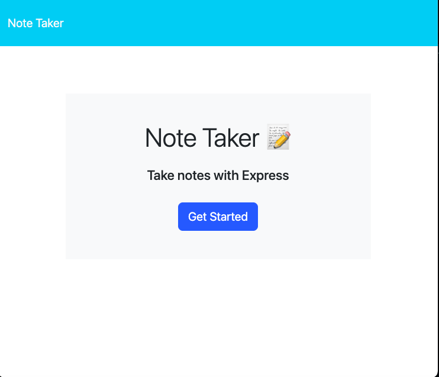
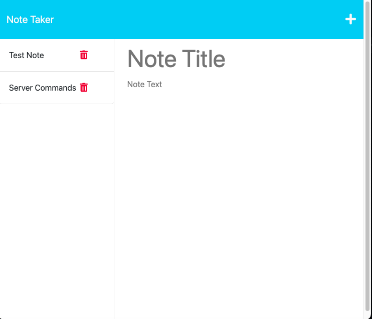
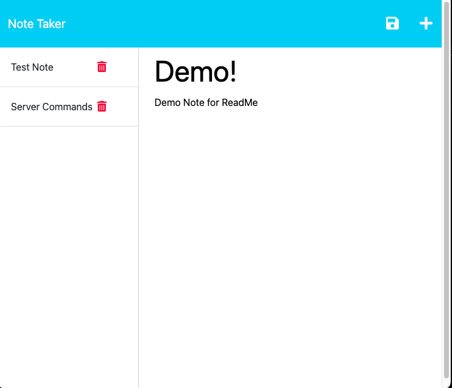
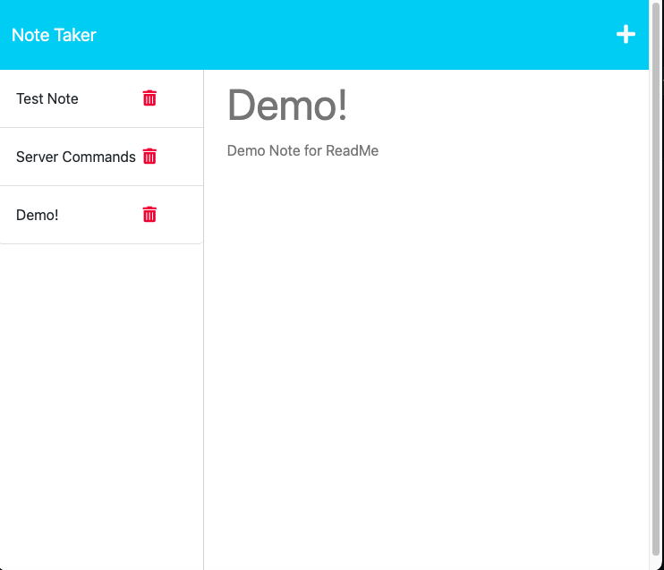

  # Note Taker

  ## Badges
  

  ## Description
  🔮 Challenge 11: Express.js - Creating a Note Taker application from starter code using Express.js that can be used to write and save notes. The application uses Express.js on the back end and saves and retrieves note data from a JSON file. Application has been deployed to [Heroku](https://messer-note-taker.herokuapp.com/): https://messer-note-taker.herokuapp.com/. 

  ## 📚 Table of Contents
  * [🔧 Installation](#installation)
  * [🎢 Usage](#usage)
  * [🚧 Contribution](#contribution)
  * [📝 Tests](#tests)
  * [🔑 License](#license)
  * [❓ Questions](#questions)
  
  ## Installation
  🔧 No installation required to access via deployment on [Heroku](https://messer-note-taker.herokuapp.com/). If running through terminal: run npm intit, npm install and npm start. Dependencies are express and uuid.

  ## Usage 
  🎢 Run npm init, npm install, then npm start from terminal or access via deployment on [Heroku](https://messer-note-taker.herokuapp.com/).  User can create a new note, save to storage, and retrieve saved note. 

  1) Homepage: 
  
  2) New blank note:
  
  3) Entering in a new note:
  
  4) Saved note appears on the left in storage:
  
  5) Retrieving the saved note:
  

  ## Contribution 
  🚧 [Contributor Covenant](https://www.contributor-covenant.org/)   
  Starter code provided from bootcampspot for the front end. 

  ## Tests
  📝 None

  ## License
  🔑 This application is covered under the MIT license.    
      Find out more here: https://choosealicense.com/licenses/mit/  
      

  ## Questions
  ❓ Have questions? Please contact Maggie Messer at:  
  * magmesser's GitHub: https://github.com/magmesser   
  * Maggie Messer's Email: magmesser@gmail.com  
  
  ❗ Repository Link: https://github.com/magmesser/note-taker
